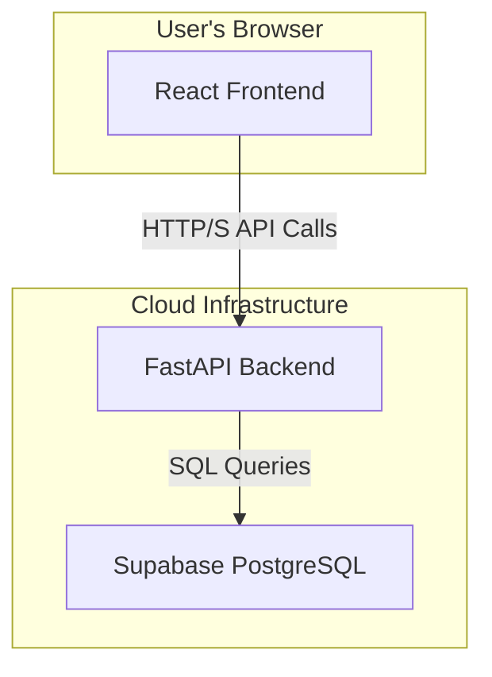

# High-Level Design (HLD) for SoleMate E-Commerce

## 1. Introduction
This document outlines the high-level architecture and design for the SoleMate e-commerce platform. It describes the major components of the system and their interactions.

## 2. System Architecture
The application follows a decoupled, client-server architecture, separating the frontend and backend concerns.

### 2.1 Frontend (Client-Side)
- **Framework**: A Single Page Application (SPA) built with React.js, Vite, and TypeScript.
- **UI**: Utilizes the `shadcn/ui` component library for a consistent and modern user interface.
- **State Management**: Client-side state (like the shopping cart and user session) is managed using React Context.
- **Routing**: Client-side routing is handled by `react-router-dom`.

### 2.2 Backend (Server-Side)
- **Framework**: A RESTful API server built with FastAPI (Python).
- **Responsibilities**:
    - Business logic processing.
    - User authentication and authorization (JWT-based).
    - Data validation using Pydantic models.
    - Interfacing with the database.
- **Database Interaction**: Uses SQLAlchemy as an ORM to communicate with the PostgreSQL database.

### 2.3 Database
- **Provider**: Supabase is used for its managed PostgreSQL database service.
- **Schema**: The database contains tables for `users` (in the `auth` schema), `profiles`, `products`, `orders`, `order_items`, and `reviews`. A detailed ERD is available in `erd.md`.

## 3. Data Flow

### 3.1 User Registration
1.  User submits registration form on the React frontend.
2.  Frontend sends a `POST` request to the `/users/` endpoint on the FastAPI backend.
3.  Backend hashes the password and creates a new user in the `auth.users` table.
4.  A database trigger creates a corresponding entry in the `public.profiles` table.
5.  Backend updates the new profile with the hashed password.

### 3.2 Product Display
1.  Frontend component (e.g., `ProductGrid`) mounts.
2.  It sends a `GET` request to the `/products/` endpoint on the FastAPI backend.
3.  Backend queries the `products` table using SQLAlchemy.
4.  The list of products is returned to the frontend as JSON.
5.  The frontend renders the product data.

### 3.3 Order Placement
1.  User proceeds to checkout from the cart.
2.  Frontend sends a `POST` request to the `/orders/` endpoint, including the JWT in the authorization header and order details in the body.
3.  Backend verifies the JWT to identify the user.
4.  Backend creates a new `orders` record and associated `order_items` records in the database.
5.  A success response is returned to the frontend.

## 4. Deployment Strategy
- **Frontend**: Deployed as a static site to a provider like Vercel or Netlify. A `vercel.json` file is configured for SPA routing.
- **Backend**: Deployed as a separate service (e.g., on Heroku, AWS, or another cloud provider that supports Python applications).
- **Database**: The Supabase PostgreSQL database is used as the persistent data store.