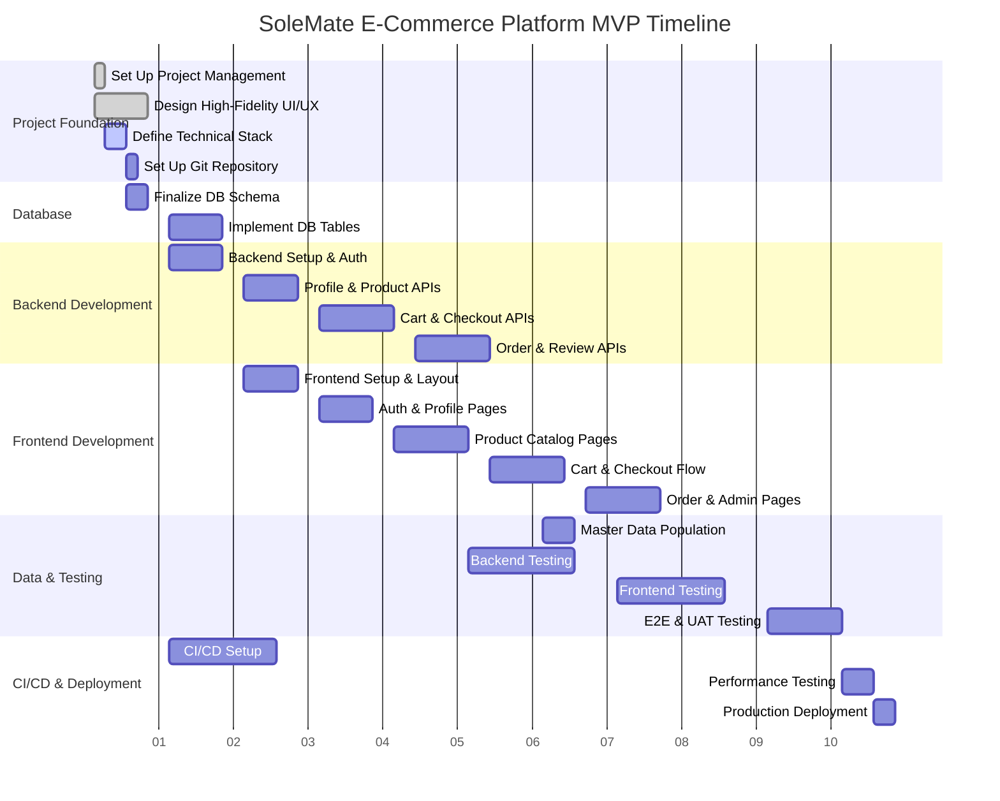

# SoleMate E-Commerce Platform: Enhanced Project Plan

This document outlines the phased project plan for the development of the SoleMate E-Commerce Platform MVP, based on the provided Software Requirements Specification. It includes the work breakdown, a high-level Gantt chart, resource allocation, risk analysis, and a cost estimate.

## 1. Work Breakdown Structure (WBS)

### 1.1 Project Foundation

- [ ] **Task Name:** Set Up Project Management & Communication Channels
  - **Estimate:** 8 person-hours
  - **Resources:** 1x Project Manager
  - **Dependencies:** None

- [ ] **Task Name:** Define Technical Stack & Architecture
  - **Estimate:** 16 person-hours
  - **Resources:** 1x Senior Backend Engineer, 1x Senior Frontend Engineer, 1x DevOps Engineer
  - **Dependencies:** None

- [ ] **Task Name:** Set Up Git Repository & Branching Strategy
  - **Estimate:** 4 person-hours
  - **Resources:** 1x DevOps Engineer
  - **Dependencies:** Define Technical Stack & Architecture

- [ ] **Task Name:** Design High-Fidelity UI/UX Mockups
  - **Estimate:** 40 person-hours
  - **Resources:** 1x UI/UX Designer
  - **Dependencies:** None

### 1.2 Database

- [ ] **Task Name:** Finalize Database Schema & Relationships
  - **Estimate:** 16 person-hours
  - **Resources:** 1x Senior Backend Engineer, 1x Database Administrator
  - **Dependencies:** Define Technical Stack & Architecture

- [ ] **Task Name:** Implement `Users` Table & Authentication Schema
  - **Estimate:** 8 person-hours
  - **Resources:** 1x Mid-level Backend Engineer
  - **Dependencies:** Finalize Database Schema & Relationships

- [ ] **Task Name:** Implement `Addresses` Table
  - **Estimate:** 4 person-hours
  - **Resources:** 1x Mid-level Backend Engineer
  - **Dependencies:** Finalize Database Schema & Relationships

- [ ] **Task Name:** Implement `Products`, `Inventory` (SKUs) Tables
  - **Estimate:** 8 person-hours
  - **Resources:** 1x Mid-level Backend Engineer
  - **Dependencies:** Finalize Database Schema & Relationships

- [ ] **Task Name:** Implement `Orders` & `Order_Items` Tables
  - **Estimate:** 8 person-hours
  - **Resources:** 1x Mid-level Backend Engineer
  - **Dependencies:** Finalize Database Schema & Relationships

- [ ] **Task Name:** Implement `Reviews` Table with Media Link
  - **Estimate:** 8 person-hours
  - **Resources:** 1x Mid-level Backend Engineer
  - **Dependencies:** Finalize Database Schema & Relationships

### 1.3 Backend

- [ ] **Task Name:** Set Up Backend Project & API Framework
  - **Estimate:** 16 person-hours
  - **Resources:** 1x Senior Backend Engineer
  - **Dependencies:** Define Technical Stack & Architecture

- [ ] **Task Name:** Implement User Registration & Password Hashing
  - **Estimate:** 12 person-hours
  - **Resources:** 1x Mid-level Backend Engineer
  - **Dependencies:** Implement `Users` Table & Authentication Schema

- [ ] **Task Name:** Implement User Login & Session Management (e.g., JWT)
  - **Estimate:** 12 person-hours
  - **Resources:** 1x Mid-level Backend Engineer
  - **Dependencies:** Implement User Registration & Password Hashing

- [ ] **Task Name:** Implement "Forgot Password" API Endpoints
  - **Estimate:** 8 person-hours
  - **Resources:** 1x Mid-level Backend Engineer
  - **Dependencies:** Implement User Registration & Password Hashing

- [ ] **Task Name:** Develop CRUD APIs for Customer Profile & Address Management
  - **Estimate:** 16 person-hours
  - **Resources:** 1x Mid-level Backend Engineer
  - **Dependencies:** Implement User Login & Session Management, Implement `Addresses` Table

- [ ] **Task Name:** Develop APIs for Product Catalog (List & Detail View)
  - **Estimate:** 12 person-hours
  - **Resources:** 1x Mid-level Backend Engineer
  - **Dependencies:** Implement `Products`, `Inventory` (SKUs) Tables

- [ ] **Task Name:** Develop API for Product Search (by name)
  - **Estimate:** 8 person-hours
  - **Resources:** 1x Mid-level Backend Engineer
  - **Dependencies:** Develop APIs for Product Catalog (List & Detail View)

- [ ] **Task Name:** Develop APIs for Shopping Cart (Add, Remove, Update Quantity)
  - **Estimate:** 16 person-hours
  - **Resources:** 1x Mid-level Backend Engineer
  - **Dependencies:** Implement User Login & Session Management

- [ ] **Task Name:** Implement Payment Gateway Integration (Stripe) for Checkout
  - **Estimate:** 24 person-hours
  - **Resources:** 1x Senior Backend Engineer
  - **Dependencies:** Develop APIs for Shopping Cart, Implement `Orders` & `Order_Items` Tables

- [ ] **Task Name:** Develop API to Create Order and Clear Cart
  - **Estimate:** 16 person-hours
  - **Resources:** 1x Mid-level Backend Engineer
  - **Dependencies:** Implement Payment Gateway Integration (Stripe)

- [ ] **Task Name:** Develop API for Customer Order History
  - **Estimate:** 8 person-hours
  - **Resources:** 1x Mid-level Backend Engineer
  - **Dependencies:** Develop API to Create Order and Clear Cart

- [ ] **Task Name:** Develop APIs for Admin Order Management (View & Update Status)
  - **Estimate:** 16 person-hours
  - **Resources:** 1x Mid-level Backend Engineer
  - **Dependencies:** Develop API to Create Order and Clear Cart

- [ ] **Task Name:** Set Up Object Storage Integration (Supabase Storage/S3)
  - **Estimate:** 8 person-hours
  - **Resources:** 1x Senior Backend Engineer
  - **Dependencies:** Define Technical Stack & Architecture

- [ ] **Task Name:** Develop API for Review Submission (with Media Upload)
  - **Estimate:** 20 person-hours
  - **Resources:** 1x Mid-level Backend Engineer
  - **Dependencies:** Set Up Object Storage Integration, Develop API for Customer Order History

- [ ] **Task Name:** Develop APIs for Admin Review Moderation (Approve/Reject)
  - **Estimate:** 12 person-hours
  - **Resources:** 1x Mid-level Backend Engineer
  - **Dependencies:** Develop API for Review Submission (with Media Upload)

### 1.4 Frontend

- [ ] **Task Name:** Set Up Frontend Project (React/Next.js) & Component Library
  - **Estimate:** 24 person-hours
  - **Resources:** 1x Senior Frontend Engineer
  - **Dependencies:** Define Technical Stack & Architecture, Design High-Fidelity UI/UX Mockups

- [ ] **Task Name:** Implement Responsive Layout & Navigation
  - **Estimate:** 24 person-hours
  - **Resources:** 1x Mid-level Frontend Developer
  - **Dependencies:** Set Up Frontend Project

- [ ] **Task Name:** Create User Registration & Login Pages
  - **Estimate:** 16 person-hours
  - **Resources:** 1x Mid-level Frontend Developer
  - **Dependencies:** Implement Responsive Layout & Navigation, Implement User Login & Session Management

- [ ] **Task Name:** Create "Forgot Password" Page & Flow
  - **Estimate:** 8 person-hours
  - **Resources:** 1x Mid-level Frontend Developer
  - **Dependencies:** Create User Registration & Login Pages, Implement "Forgot Password" API Endpoints

- [ ] **Task Name:** Create Customer Profile & Address Management Pages
  - **Estimate:** 20 person-hours
  - **Resources:** 1x Mid-level Frontend Developer, 1x Junior Frontend Developer
  - **Dependencies:** Create User Registration & Login Pages, Develop CRUD APIs for Customer Profile & Address Management

- [ ] **Task Name:** Create Product Grid/Listing Page
  - **Estimate:** 24 person-hours
  - **Resources:** 1x Mid-level Frontend Developer, 1x Junior Frontend Developer
  - **Dependencies:** Implement Responsive Layout & Navigation, Develop APIs for Product Catalog (List & Detail View)

- [ ] **Task Name:** Create Product Detail Page
  - **Estimate:** 20 person-hours
  - **Resources:** 1x Mid-level Frontend Developer
  - **Dependencies:** Product Grid/Listing Page, Develop APIs for Product Catalog (List & Detail View)

- [ ] **Task Name:** Implement Product Search Bar Component
  - **Estimate:** 12 person-hours
  - **Resources:** 1x Mid-level Frontend Developer
  - **Dependencies:** Create Product Grid/Listing Page, Develop API for Product Search (by name)

- [ ] **Task Name:** Create Shopping Cart View & Components
  - **Estimate:** 16 person-hours
  - **Resources:** 1x Mid-level Frontend Developer
  - **Dependencies:** Create Product Detail Page, Develop APIs for Shopping Cart

- [ ] **Task Name:** Create Single-Page Checkout Form
  - **Estimate:** 32 person-hours
  - **Resources:** 1x Senior Frontend Engineer
  - **Dependencies:** Create Shopping Cart View & Components, Implement Payment Gateway Integration (Stripe)

- [ ] **Task Name:** Create Customer Order History Page
  - **Estimate:** 16 person-hours
  - **Resources:** 1x Mid-level Frontend Developer
  - **Dependencies:** Create Single-Page Checkout Form, Develop API for Customer Order History

- [ ] **Task Name:** Implement Product Review Submission Form
  - **Estimate:** 20 person-hours
  - **Resources:** 1x Mid-level Frontend Developer
  - **Dependencies:** Create Product Detail Page, Develop API for Review Submission (with Media Upload)

- [ ] **Task Name:** Create Admin Dashboard for Order Management
  - **Estimate:** 24 person-hours
  - **Resources:** 1x Mid-level Frontend Developer
  - **Dependencies:** Create User Registration & Login Pages, Develop APIs for Admin Order Management

- [ ] **Task Name:** Create Admin Dashboard for Review Moderation
  - **Estimate:** 16 person-hours
  - **Resources:** 1x Mid-level Frontend Developer
  - **Dependencies:** Create User Registration & Login Pages, Develop APIs for Admin Review Moderation

### 1.5 Master Data Population

- [ ] **Task Name:** Create Scripts/Process for Populating Products & Inventory
  - **Estimate:** 16 person-hours
  - **Resources:** 1x Mid-level Backend Engineer
  - **Dependencies:** Implement `Products`, `Inventory` (SKUs) Tables

- [ ] **Task Name:** Populate Staging Environment with Sample Data
  - **Estimate:** 8 person-hours
  - **Resources:** 1x Junior Backend Engineer
  - **Dependencies:** Create Scripts/Process for Populating Products & Inventory

### 1.6 Testing & QA

- [ ] **Task Name:** Develop Backend Unit & Integration Test Suite
  - **Estimate:** 80 person-hours
  - **Resources:** 1x Mid-level Backend Engineer, 1x QA Engineer
  - **Dependencies:** All Backend tasks

- [ ] **Task Name:** Develop Frontend Unit & Component Test Suite
  - **Estimate:** 80 person-hours
  - **Resources:** 1x Mid-level Frontend Developer, 1x QA Engineer
  - **Dependencies:** All Frontend tasks

- [ ] **Task Name:** Perform End-to-End (E2E) Manual Testing
  - **Estimate:** 40 person-hours
  - **Resources:** 2x QA Engineers
  - **Dependencies:** All Backend tasks, All Frontend tasks, Populate Staging Environment with Sample Data

- [ ] **Task Name:** Perform User Acceptance Testing (UAT)
  - **Estimate:** 24 person-hours
  - **Resources:** 1x Project Manager, Business Stakeholders
  - **Dependencies:** Perform End-to-End (E2E) Manual Testing

- [ ] **Task Name:** Perform Performance & Load Testing
  - **Estimate:** 24 person-hours
  - **Resources:** 1x DevOps Engineer, 1x Senior Backend Engineer
  - **Dependencies:** Perform End-to-End (E2E) Manual Testing

### 1.7 CI/CD & Deployment

- [ ] **Task Name:** Set Up CI Pipeline for Automated Builds & Testing
  - **Estimate:** 24 person-hours
  - **Resources:** 1x DevOps Engineer
  - **Dependencies:** Set Up Git Repository & Branching Strategy, Develop Backend Unit & Integration Test Suite, Develop Frontend Unit & Component Test Suite

- [ ] **Task Name:** Set Up Staging & Production Environments
  - **Estimate:** 32 person-hours
  - **Resources:** 1x DevOps Engineer
  - **Dependencies:** Define Technical Stack & Architecture

- [ ] **Task Name:** Configure CD Pipeline for Automated Deployments to Staging
  - **Estimate:** 16 person-hours
  - **Resources:** 1x DevOps Engineer
  - **Dependencies:** Set Up CI Pipeline for Automated Builds & Testing, Set Up Staging & Production Environments

- [ ] **Task Name:** Plan & Execute Production Deployment
  - **Estimate:** 8 person-hours
  - **Resources:** 1x DevOps Engineer, 1x Senior Backend Engineer, 1x Senior Frontend Engineer
  - **Dependencies:** Perform User Acceptance Testing (UAT), Perform Performance & Load Testing, Configure CD Pipeline for Automated Deployments to Staging

## 2. High-Level Gantt Chart (Timeline)

**Assumption:** The project will be staffed with the recommended team size, and work will proceed on a standard 8-hour workday. The timeline is represented in weeks from the project start date.

## 3. Resource Allocation Matrix

This matrix outlines the roles required for the project and their allocation across different phases.

| Role                       | Quantity | Project Foundation | Database | Backend | Frontend | Data & Testing | CI/CD & Deployment |
| -------------------------- | :------: | :----------------: | :------: | :-----: | :------: | :------------: | :----------------: |
| Project Manager            |    1     |        High        |   Low    | Medium  |  Medium  |      High      |        Low         |
| UI/UX Designer             |    1     |        High        |   Low    |   Low   |   High   |      Low       |        N/A         |
| Senior Backend Engineer    |    1     |        High        |   High   |  High   |   Low    |     Medium     |        High        |
| Mid-level Backend Engineer |    1     |        N/A         |   High   |  High   |   N/A    |      High      |        N/A         |
| Junior Backend Engineer    |    1     |        N/A         |   N/A    |   N/A   |   N/A    |      High      |        N/A         |
| Senior Frontend Engineer   |    1     |        High        |   N/A    |   Low   |   High   |      Low       |        Low         |
| Mid-level Frontend Developer|    2     |        N/A         |   N/A    |   N/A   |   High   |      High      |        N/A         |
| DevOps Engineer            |    1     |        High        |   Low    |   Low   |   Low    |     Medium     |        High        |
| Database Administrator (DBA)|    1     |        N/A         |   High   |  Medium |   N/A    |      Low       |        Low         |
| QA Engineer                |    2     |        N/A         |   Low    | Medium  |  Medium  |      High      |        Low         |
| Business Stakeholders      |   2-3    |        Low         |   N/A    |   N/A   |   N/A    |      High      |        Low         |

## 4. Risk Analysis and Mitigation Plan

| Risk ID | Risk Description                                        | Probability | Impact | Mitigation Plan                                                                                             |
| :------ | :------------------------------------------------------ | :---------: | :----: | :---------------------------------------------------------------------------------------------------------- |
| R-01    | **Scope Creep:** Additional features requested mid-project. |    High     |  High  | Implement a strict change control process. All new requests must be evaluated for impact and scheduled for future releases. |
| R-02    | **Technical Debt:** Rushed implementation leads to poor code quality. |   Medium    |  High  | Enforce code reviews, adhere to the defined architecture, and allocate time for refactoring within the testing phase. |
| R-03    | **Third-Party Dependency:** Payment gateway or storage service has an outage or API changes. |     Low     |  High  | Develop modular integrations. Have a contingency plan to swap services if necessary. Monitor service status pages. |
| R-04    | **Resource Unavailability:** Key personnel become unavailable. |   Medium    | Medium | Promote knowledge sharing and documentation. Cross-train team members on critical components where possible. |
| R-05    | **Performance Bottlenecks:** Application does not meet performance requirements under load. |   Medium    |  High  | Conduct performance testing early and often. Optimize critical paths (e.g., checkout, product search) proactively. |
| R-06    | **Security Vulnerabilities:** The platform is exposed to common web attacks. |    High     |  High  | Follow security best practices (e.g., OWASP Top 10), conduct security code reviews, and use automated security scanning tools in the CI pipeline. |
| R-07    | **Inaccurate Estimates:** Tasks take longer than anticipated, delaying the timeline. |    High     | Medium | Break down tasks into smaller, more manageable units. Re-evaluate estimates as development progresses and adjust the plan accordingly. |

## 5. Summary Cost Estimate

**Assumptions:**
- Blended hourly rates are used for estimation purposes. These are placeholders and should be replaced with actual rates.
  - Project/Management Roles (PM, Stakeholders): $75/hour
  - Design Roles (UI/UX): $70/hour
  - Senior Engineering (Backend, Frontend, DevOps): $90/hour
  - Mid-level Engineering/QA: $65/hour
  - Junior Engineering: $50/hour
  - DBA: $80/hour
- The total hours are derived from the Work Breakdown Structure.
- A 20% contingency buffer is added to the total cost to account for unforeseen risks and inaccuracies in estimates.

| Category                 | Estimated Hours | Blended Rate | Estimated Cost |
| :----------------------- | :-------------: | :----------: | :------------: |
| Project Foundation       |       68        |    $81.18    |   $5,520.00    |
| Database                 |       52        |    $70.00    |   $3,640.00    |
| Backend Development      |       152       |    $73.68    |   $11,200.00   |
| Frontend Development     |       228       |    $68.25    |   $15,560.00   |
| Master Data Population   |       24        |    $61.67    |   $1,480.00    |
| Testing & QA             |       248       |    $67.42    |   $16,720.00   |
| CI/CD & Deployment       |       80        |    $90.00    |   $7,200.00    |
| **Subtotal**             |     **852**     |              | **$61,320.00** |
| **Contingency (20%)**    |                 |              | **$12,264.00** |
| **Total Estimated Cost** |                 |              | **$73,584.00** |