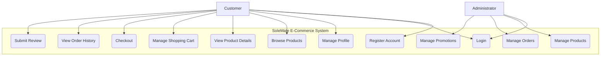

# Use Case Diagrams & User Stories for SoleMate E-Commerce

## 1. Use Case Diagram

A Use Case Diagram visually represents the interactions between actors (users) and the system. It provides a high-level overview of the system's functionality.

### 1.1 Actors
*   **Customer**: A general user of the website.
*   **Administrator**: A privileged user with access to the admin panel.

### 1.2 Diagram (Mermaid Syntax)

## 2. User Stories

User Stories are short, simple descriptions of a feature told from the perspective of the person who desires the new capability, usually a user or customer of the system.

### 2.1 Customer User Stories

*   **Account Management:**
    *   As a new user, I want to register for an account so that I can make purchases and save my information.
    *   As a registered user, I want to log in to my account to access my profile and order history.
    *   As a logged-in user, I want to manage my profile information and shipping addresses so that my details are up-to-date.

*   **Product Browsing:**
    *   As a customer, I want to view a grid of all available products so that I can browse the catalog.
    *   As a customer, I want to click on a product to see a detailed page with more images and information.

*   **Shopping & Checkout:**
    *   As a customer, I want to add products to my shopping cart so that I can purchase them.
    *   As a customer, I want to adjust the quantity of items in my cart or remove them.
    *   As a customer, I want to go through a secure checkout process to complete my purchase.

*   **Post-Purchase:**
    *   As a customer, I want to view my order history to track my past purchases.
    *   As a customer who has purchased a product, I want to submit a review and star rating to share my feedback.

### 2.2 Administrator User Stories

*   **Product Management:**
    *   As an administrator, I want to log in to a secure admin panel.
    *   As an administrator, I want to add, edit, and delete products in the catalog.
    *   As an administrator, I want to manage stock levels for each product.

*   **Order Management:**
    *   As an administrator, I want to view a list of all customer orders to manage fulfillment.

*   **Promotions:**
    *   As an administrator, I want to create and manage discount codes.